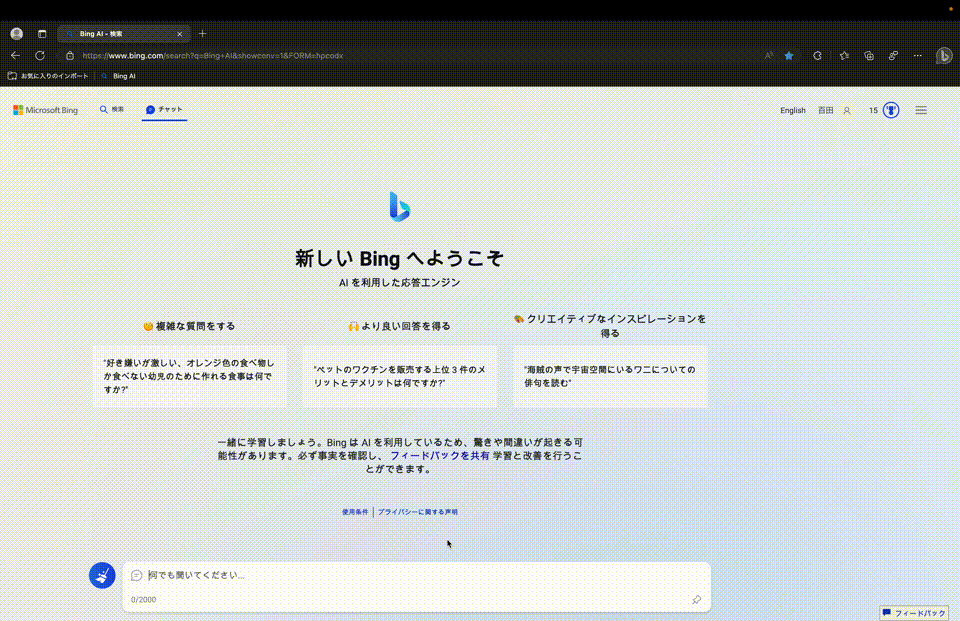

# Bing AI Enter for MacOS

Bing AIでのチャット送信を`「Command + Enter」`で出来るように改変するブラウザ拡張機能

（MacOSでBing AIを使うと漢字変換を確定する時にチャットが送信されてしまい非常に使いづらいため）

### 使用方法

1. Edgeを開く
2. 右上の三点リーダーから「拡張機能」をクリックし「拡張機能の管理」へ
3. 「展開して読み込み」をクリックしこのフォルダをアップロード
4. Edge再起動

### デモ

Before

After

### 参考記事
[新しいBingのAIチャットで漢字変換を確定させるときに意図せず送信されるのを防ぐ](https://qiita.com/NOSP/items/81fc3ec5bb1b7dd3d561)